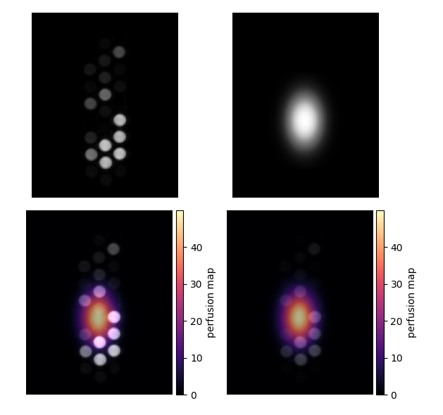

.. _Colors:

Working with Colors
===================

Color Data Type
---------------

Color Series are represented as RGB images using bytes (uint8) for
each of the red, green and blue (R, G, B) color components.
The structured NumPy dtype is used to code the color of each
Series pixel.

.. code-block:: python

    np.dtype([('R', 'u1'), ('G', 'u1'), ('B', 'u1')])

The color dimension does not appear as a separate Series dimension.
Therefore, slicing a color Series object is no different from slicing
a gray-scale Series object.
However, the individual color components can be addressed by the color name, like
setting the red color component to zeros:

.. code-block:: python

    s['R'] = np.zeros(...)

Creating Color Series
---------------------

Let's start by creating some random data:

.. code-block:: python

    from imagedata import Series
    import numpy as np
    from numpy.random import default_rng
    rng = default_rng()
    s = Series(rng.standard_normal(3*128*128).reshape((3,128,128)))

This `s` Series with shape (3, 128, 128) can be converted into an RGB image using
the :meth:`imagedata.Series.to_rgb` method:

.. code-block:: python

    rgb = s.to_rgb()

Although `rgb` is a color Series, it will appear as a gray-scale image when displayed,
because all R, G and B color components are identical.

The `rgb` Series will still have shape (3, 128, 128).
However, the `rgb.dtype` will be a structured RGB dtype.
Also, the `s` intensities are scaled to the RGB range of 0:255 for each
color component.
The original intensities of `s` are not maintained in `rgb`.

Saving and Loading Color Series
-------------------------------

Color images will be read and written using the photometricInterpretation
set in the DICOM data.
The photometricInterpretation is by default 'MONOCHROME2' (grayscale from black to white),
while RGB data has a photometricInterpretation of 'RGB'.

.. code-block:: python

    s = Series('color_data')
    print(s.shape, s.dtype)

    s.show()

    s.write('new_data')

Fuse Series and Mask
--------------------

The :meth:`imagedata.Series.fuse_mask`
method will fuse an original series with a mask.
An `alpha` parameter determines the blending between the original image and the mask.

The mask can be binary or variable:

  * A binary mask will be gaussian filtered to disperse the edges, and
    overloaded on the original series in red color.
  * A variable mask is converted to a color mask using a color map (by default 'magma').
    This color mask is overloaded on the original series.

.. code-block:: python

    mask = Series(np.zeros((3,128,128), dtype=np.uint8))
    mask[2, 48:80, 48:80] = 1
    fused = s.fuse_mask(mask)
    fused.show()

When to blend the original series
"""""""""""""""""""""""""""""""""

By default, fuse_mask() will not blend the original series.
When using `blend=True`, the original series intensity will be reduced to alpha level,
while the mask is shown at (1-alpha).

The fuse_mask result with and without blending is shown in :numref:`fuse_mask_blend_figure`:

   Example results of :meth:`imagedata.Series.fuse_mask`.
   Original image: upper left; variable "perfusion mask": upper right;
   fused image without blending: lower left; fused image with blending: lower right.

