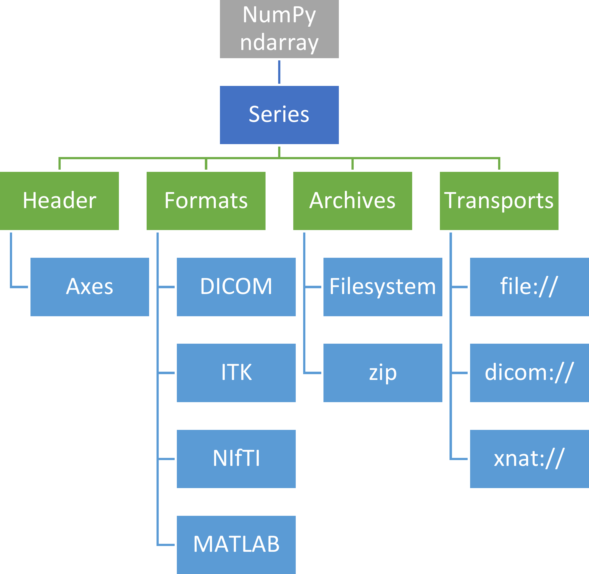

.. _Plugins:

Plugin Architecture
====================

The imagedata package defines a plugin architecture allowing the user to
add modules for image format, archive and transport methods.
The architecture is depicted in the Figure here.

Image format plugins
---------------------

Image data comes in a number of formats, where each format module takes
responsibility for loading the image data into a Series instance.

Archive plugins
-----------------

The archive module lets Python access files in a local filesystem, a zip
file or a tar.gz file.

Transport plugins
------------------

The transport module allows access to both local and networked data.
